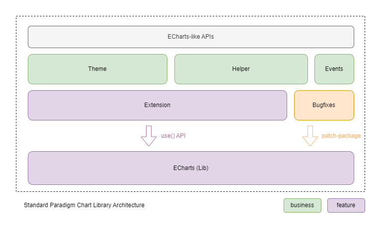
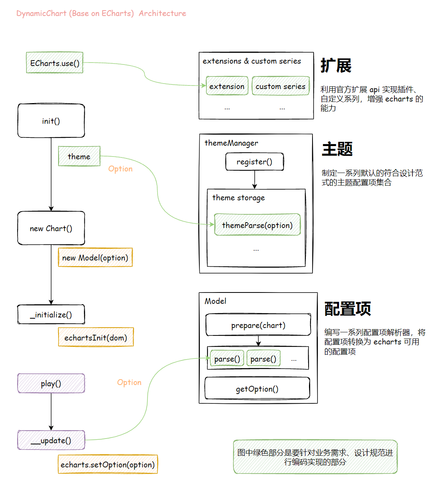
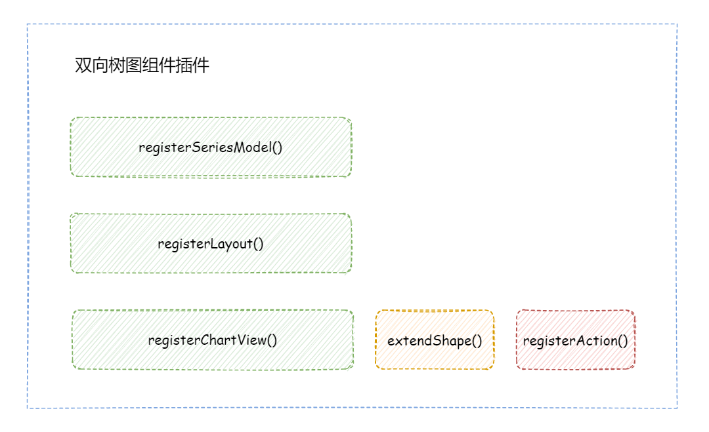
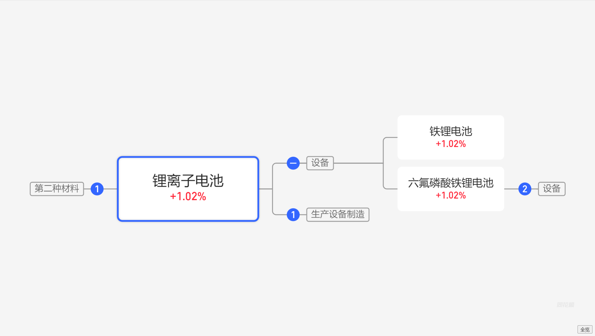
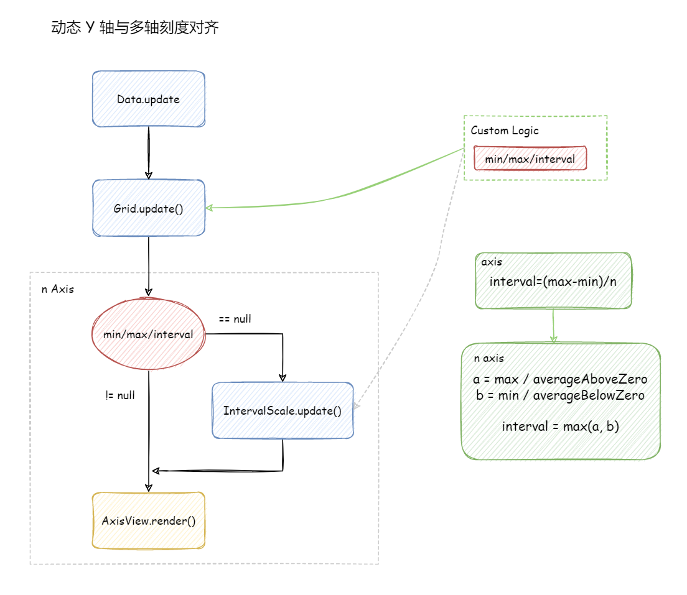
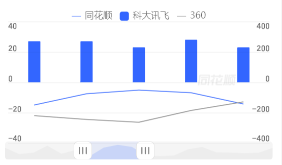

# 架构概述

标准范式组件库是基于 [ECharts(v5.3.3)](https://echarts.apache.org/) 深度定制化开发的，本节内容将分别从范式组件库和 ECharts 两方面对其架构设计进行简单的介绍。

## 范式组件库

范式组件库是基于 ECharts 提供的扩展 API 设计的，通过深度定制化开发为业务提供技术支撑，并结合业务做一些封装设计，例如主题机制。

### 架构图



参考上图，范式组件库主要完成两方面事情：

- 扩展 ECharts 的功能（插件开发、修复 bugs）
- 业务封装（主题机制、辅助类、自定义事件）

最后，组件库的 APIs 设计遵循类似 ECharts 的设计思路，降低学习成本。

### 项目目录结构

```plain
.
├── assets                       # 静态资源（不会打包到生产环境）
├── docs                         # 文档（主要文档由另一个项目单独维护）
├── examples                     # 开发环境调试示例
│   ├── guide                     # 代码案例对应的示例
│   ├── test                      # 功能测试示例
│   ├── types                     # 图表分类示例
│   └── index.html
├── patches                      # 修复的 bugs 记录
│   └── echarts+5.3.3.patch
├── scripts
├── src
│   ├── assets                   # 组件库依赖的静态资源
│   ├── core
│   │   ├── EventEmitter.ts
│   │   ├── EventHandler.ts       # 组件库自定义事件定义
│   │   ├── option.ts
│   │   ├── StandardChart.ts      # 组件实例类的核心实现
│   │   └── theme.ts              # 主题机制的核心实现
│   ├── extension                # ECharts 扩展实现
│   │   ├── guide                # 代码案例（不会打包到生产环境）
│   │   ├── graphic               # 扩展：自定义图形
│   │   ├── component             # 扩展：组件
│   │   └── series                # 扩展：图表
│   ├── helper                   # 辅助类
│   ├── theme                    # 预置的主题实现
│   │   ├── business
│   │   ├── mobile
│   │   └── pc
│   ├── util
│   ├── common.less              # 组件库全局样式
│   ├── index.ts
│   ├── installExtension.ts      # 预安装的 ECharts 扩展
│   ├── installTheme.ts          # 预安装的主题
│   └── standardChart.ts         # 组件实例化 API 定义
└── CHANGELOG.md                 # 更新日志
```

项目源代码包含以下两部分：

- _src/_
- _patches/_

其中，_patches/_ 目录是利用 [patch-package](https://www.npmjs.com/package/patch-package) 对 ECharts 的 bugs 进行修复的记录。

#### 组件开发

以下是组件开发的几个主要步骤及其相关的文件夹：

1. _src/extension_：完成对 ECharts 不支持的功能的扩展开发
2. _src/helper_：将一些偏业务开发的逻辑封装成辅助类
3. _src/theme_：封装主题逻辑
4. _examples/_：添加调试示例，验证功能
5. _CHANGELOG.md_：更新版本发布日志

:::tip

要及时更新配置项和 APIs 文档，组件库的文档维护在单独的项目中，请查看[文档说明](#文档)。

:::

:::info

_src/extension_ 目录下是功能扩展的实现，具体请参考 [ECharts 的插件机制](./4-echarts-plugin.md)。

:::

:::info

_src/theme_ 目录下是业务主题的实现，具体请参考[主题机制](./7-theme/token.md)。

:::

#### 自定义事件

如果要为组件库新增自定义事件，需将事件定义添加在 _src/core/EventHandler.ts_ 文件中。

:::warning

**自定义事件**指的是因为整体设计和业务需要，[ECharts 事件](https://echarts.apache.org/zh/api.html#events)不能满足需求的情况下新增的事件类型，不要随意添加。

:::

#### 文档

范式组件库文档基于 [Docusaurus](https://docusaurus.io/) 构建，**在单独的项目中维护**，这里简单的说明一下文档项目的目录结构，以便了解如何在开发完成后更新文档。

```plain
.
├── apis                                 # 扩展 APIs 和配置项文档
│   ├── component                         # 组件：对应于组件库 src/extension/component 目录
│   ├── series                            # 图表：对应于组件库 src/extension/series 目录
│   ├── helper                            # 辅助类：对应于组件库 src/helper 目录
│   ├── api.md                            # 组件库实例 APIs
│   ├── option.md                         # 全局配置项
│   └── theme.md                          # 主题相关 APIs
├── changelog                            # 更新日志
│   ├── CHANGELOG.md                      # 和组件库 CHANGELOG.md 文件内容保持同步
│   └── MIGRATION_GUIDE_V1.md
├── docs
│   ├── developer-guide                 # 组件开发指南
│   ├── ecahrts-reference               # EChart 技术参考
│   ├── zrender-reference               # ZRender 技术参考
│   ├── FAQ.md                          # 常见问题
│   ├── overview.md
│   ├── SSR.md
│   ├── statistics.md
│   └── usage-guide.md
└── more                               # 为了文档维护方便，这是一些其它组件库的文档
    ├── candlestick-chart-docs
    ├── d3charts-docs
    ├── paradigm-3d-globe
    └── paradigm-timeline-docs
```

:::info

请按[格式要求](./0-CONTRIBUTING.md#文档的编写规范)更新文档内容。

:::

## ECharts

ECharts 相关内容均基于源码分析而来，**非官方资料**。

### 架构图


### 项目目录结构

```plain
.
├── action       //交互行为
├── animation    //动画配置
│   ├── basicTransition.ts //基础动画过渡
├── chart        //图表组件
│   ├── custom   //自定义图表
│   │   ├── CustomSeries.ts //自定义系列的数据层对象实现，继承自SeriesModel
│   │   ├── CustomView.ts   //自定义系列的视图层对象实现，继承自ChartView
│   │   └── install.ts      //系列的注册方法
│   ├── bar     //条形图
│   ├── line    //折线图
│   ├── pie     //饼图
│   └── ...
├── component    //通用组件
│   ├── axis     //坐标轴组件
│   ├── grid     //网格
│   ├── tooltip  //提示框
│   └── ...
├── coord        //坐标系
├── core         //核心代码
├── data         //数据处理
├── label        //标签组件
├── layout       //布局
├── model        //模型定义
│   ├── Component.ts  //组件模型，继承自Model
│   ├── Global.ts     //全局模型，继承自Model
│   ├── Model.ts      //通用模型
│   └── Series.ts     //系列模型，继承自ComponentModel
├── scale        //比例尺
├── theme        //主题
├── util         //工具方法
├── visual       //视觉编码
├── view         //视图组件
│   ├── Chart.ts      //图表视图的基类ChartView
│   └── Component.ts //组件视图的基类Component，继承自ChartView
├── renderer     //渲染器
└── echarts.ts   //入口文件
```

## 程序设计

底层基于 ECharts 的能力，基于三个方面对其能力进行抽象实现：

- 扩展/自定义系列
  - 目的是增强 echarts 的能力，实现预期功能和效果
- 主题
  - 将设计范式定义为一系列的默认配置项，方便复用和简化使用成本
- 配置项解析器（**将被弃用，以扩展的形式实现**）
  - 对配置项的预处理过程，通常可以将实现一个功能依赖的一系列复杂配置项和计算逻辑抽象为单个扩展配置项，将复杂度隐藏在内部来实现



### 案例：自定义系列-双向树图组件

借助 `use() API` 我们可以很容易的以弱耦合的方式为 ECharts 新增一个图表类型的实现，以自定义系列图表-双向树图组件为例。



实现的效果：



### 案例：动态 Y 轴及多轴刻度对齐

通常来说，在粗粒度层面对 ECharts 进行扩展开发借助已有的 APIs 即可，但在一些细粒度层面，仅仅依赖这些插件 APIs 是不够的。例如在对 Y 轴的分割方案做定制化开发时，首先需要分析源码中 Y 轴的刻度分割实现细节，基于数据驱动视图的模式，从数据层面做能解决本质问题，且影响面可控；其次，为了以弱耦合的方式实现，便于后续迭代升级和迁移，不选择直接更改源码（或者 fork 分支进行维护），而是以类似 polyfills 的模式去覆盖关键类的某些方法的实现来完成。



实现的效果：



## 迭代日志

框架架构迭代调整的记录。

### 2022-08-08

- 框架设计
  - 考虑到维护多周期的调度增加了复杂性，业务方使用时不够灵活，为了契合 echarts 的设计理念，框架的设计仅负责单周期的数据渲染
- API
  - `init()` 方法的参数与 echarts 的 `init()` 方法保持一致，不同的是第二个参数 `theme` 的逻辑由我们自己来实现
  - `play()` 方法以类似 echarts 的 `setOption()` 方法的模式由用户传递 `option` 配置，渲染单周期数据
- 配置项
  - 配置项的 `id` 暂定为由业务方传递（这样风险小，让业务方了解发生了什么，符合业务方的预期），后续考虑优化方案

### 2022-08-04

- 事件

为了以统一的 API 处理自定义事件和 ECharts 实例的事件，引入 `EventHandler` 类，暴露与 ECharts 相同的 API（`on()` 和 `off()`），在实现过程中，自定义事件的命名均以 `dv:` 前缀命名，不带该前缀的事件将会委托给 ECharts 实例处理。

```ts
// ECharts Events
// see https://echarts.apache.org/zh/api.html#echartsInstance.on
// see https://echarts.apache.org/zh/api.html#events
chart.on('finished', () => {});

// Custom Events
chart.on('dv:beforeinit', () => {});
```

### 2022-07-27

- 配置项

```ts
// 以前
{
  data,
  option
  theme,
}


// 现在
{
  data,
  baseOption,
  options?, // 支持多周期的配置覆盖，和 data 索引一一对应，参考 echarts 的时间轴配置
  theme
}
```

- 程序的执行流程

伪代码。

```ts
// 以前 -----------------------------------
use(); // * 注册插件
init() {
  parseTheme(); // * 解析主题

  new Chart() {
    new Dataset();
    new Model() {
      parse() {
        modelParse(); // * 配置项解析
      }
    }
  }
}

loop() { // 周期循环
  update() {
    this._dataset.parse();
    this._dataset.getReadData(); // 获取数据
    this._model.parse();
    this._model.getReadOption(); // 获取配置项

    parseData(); // 解析数据

    echarts.setOption();
  }
}

// 现在 -----------------------------------
use(); // * 注册插件
init() {
  new Chart() {
    new Dataset();
    new Model() {
      parse() {
        parseData(); // 解析数据
        parseTheme(); // * 解析主题
        modelParse(); // * 配置项解析
      }
    }
  }
}

loop() { // 周期循环
  update() {
    this._model.parse();
    this._model.getReadOption(); // 获取配置项

    echarts.setOption();
  }
}
```

这里有几点做了调整：

- **主题配置解析**以前只在初始化时做一次解析，现在每个周期都会进行解析（因为每个周期的配置项可能存在差异性）
- **数据解析**以前是放在控制层调度的，现在将**数据解析、主题配置项解析、Model 解析** 统一放入 Model 中调度，程序执行流程上上更为清晰一些
