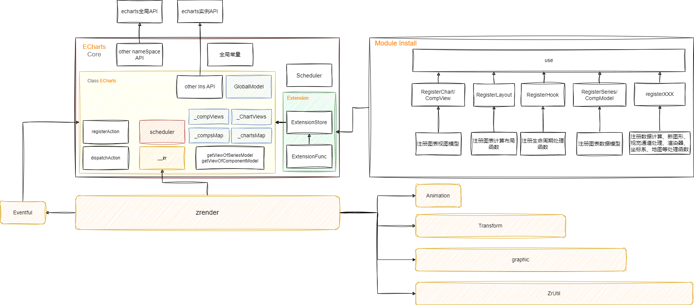

# 架构概述

本节内容主要是对 ECharts 的架构设计进行简单的介绍。

## ECharts

ECharts 相关内容均基于源码分析而来，**非官方资料**。

### 架构图



### 项目目录结构

```plain
.
├── action       //交互行为
├── animation    //动画配置
│   ├── basicTransition.ts //基础动画过渡
├── chart        //图表组件
│   ├── custom   //自定义图表
│   │   ├── CustomSeries.ts //自定义系列的数据层对象实现，继承自SeriesModel
│   │   ├── CustomView.ts   //自定义系列的视图层对象实现，继承自ChartView
│   │   └── install.ts      //系列的注册方法
│   ├── bar     //条形图
│   ├── line    //折线图
│   ├── pie     //饼图
│   └── ...
├── component    //通用组件
│   ├── axis     //坐标轴组件
│   ├── grid     //网格
│   ├── tooltip  //提示框
│   └── ...
├── coord        //坐标系
├── core         //核心代码
├── data         //数据处理
├── label        //标签组件
├── layout       //布局
├── model        //模型定义
│   ├── Component.ts  //组件模型，继承自Model
│   ├── Global.ts     //全局模型，继承自Model
│   ├── Model.ts      //通用模型
│   └── Series.ts     //系列模型，继承自ComponentModel
├── scale        //比例尺
├── theme        //主题
├── util         //工具方法
├── visual       //视觉编码
├── view         //视图组件
│   ├── Chart.ts      //图表视图的基类ChartView
│   └── Component.ts //组件视图的基类Component，继承自ChartView
├── renderer     //渲染器
└── echarts.ts   //入口文件
```
