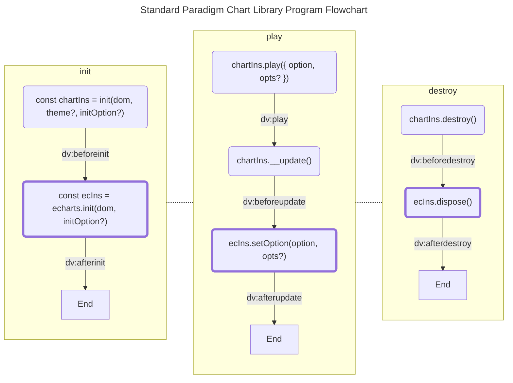

# 程序执行流程

本节内容主要是介绍范式组件库和 ECharts 的程序执行流程，帮助我们更好的理解两者是如何进行协作的。

## 范式组件库

以上就是范式组件库的程序执行流程简图，其中包含了三个关键阶段，对应的也是组件库的常用 APIs：

- [`init()`](../../apis/api.md#init)：初始化组件实例
- [`chartIns.play()`](../../apis//api.md#play)：播放渲染
- [`chartIns.destroy()`](../../apis//api.md#destroy)：销毁组件实例

:::tip

上图中粗边框的节点为 [echarts 的 APIs](https://echarts.apache.org/zh/api.html#echarts) 调用。

:::

:::tip

上图中节点之间连线上的文本节点代表的是组件库的[自定义事件](../../apis/api.md#生命周期事件)及其触发时机。

:::

## ECharts

> WIP

以下为 ECharts 提供的生命周期事件 APIs 及其关键的程序执行流程图，了解 ECharts 中几个核心的程序关键点如组件（Component）和系列（Series）的更新先后。

<!-- ./assets/echarts-lifecycle.drawio -->
<iframe src="https://datav.iwencai.com/example.html#/static-page?id=171&mode=preview" loading="lazy" width="100%" height="800px" style="background-color: #fff; width: 400px; height: 1100px;"></iframe>
