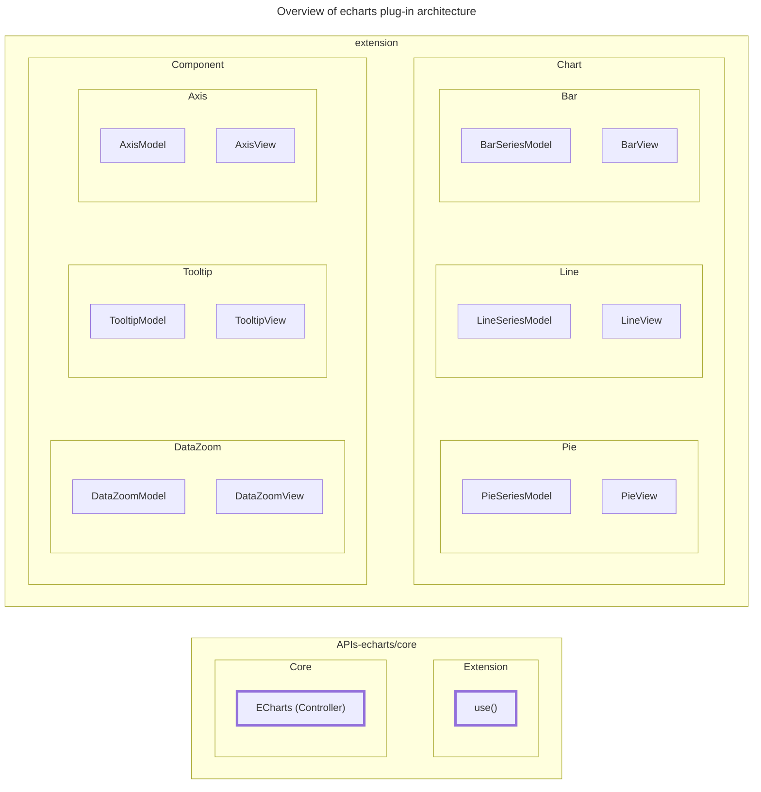
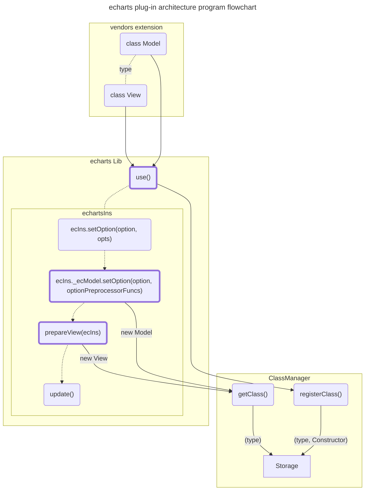
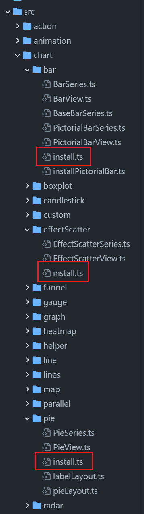

# ECharts 的插件机制

ECharts 的插件式架构设计为图表组件开发提供了一个低耦合性、可靠的方案，本节内容主要讲述扩展（插件）机制和 APIs 设计，及其部分技术细节。

:::note

ECharts 默认提供了数十种类型图表的实现，所以代码库非常庞大。另一方面，现有类型的图表并非全部都是在初始版本实现的，为了在不断迭代的过程中新增其它类型图表实现的同时保证现有类型图表实现的稳定性，每一种类型的图表实现都被设计为一个独立的“插件”。

:::

## 插件架构设计

首先，了解一下插件架构的整体设计以及程序的执行流程，帮助我们更深入的理解 ECharts 是如何将图表的具体实现与组件库核心实现解耦的。此外，从单个图表组件的实现来分析，ECharts 遵循的是经典的 [MVC 模式](https://en.wikipedia.org/wiki/Model%E2%80%93view%E2%80%93controller)。

### 架构概览



上图可以看出，ECharts 的核心实现和扩展实现提供了 APIs 层，具体的图表和组件实现可以安全的和组件库的 APIs 层剥离，这也是[官方文档中提及的按需引入](https://echarts.apache.org/handbook/zh/basics/import#%E6%8C%89%E9%9C%80%E5%BC%95%E5%85%A5-echarts-%E5%9B%BE%E8%A1%A8%E5%92%8C%E7%BB%84%E4%BB%B6)实现的基础。

**核心实现充当了控制器（Controller）的角色，各个图表和组件只需要提供数据层（Model）和视图层（View）的实现即可。**

### 程序执行流程



通过探索插件程序的执行流程，我们可以了解更多的技术细节，从而更好的掌握如何完成插件开发。

**通常，插件程序需要在 [ECharts 实例化（`init()`）](https://echarts.apache.org/zh/api.html#echarts.init)之前通过 [`use()` API](https://echarts.apache.org/zh/api.html#echarts.use) 进行注册。**内部实现为一个类管理器，以类的 `type` 为 key 维护一个集合。

```typescript title="https://github.com/apache/echarts/blob/5.3.3/src/util/clazz.ts#L226"
export function enableClassManagement(
    target: ClassManager
): void {

    /**
     * Component model classes
     * key: componentType,
     * value:
     *     componentClass, when componentType is 'a'
     *     or Object.<subKey, componentClass>, when componentType is 'a.b'
     */
    const storage: {
        [componentMainType: string]: (Constructor | SubclassContainer)
    } = {};

    target.registerClass = function (
        clz: Constructor
    ): Constructor {

        // `type` should not be a "instance memeber".
        // If using TS class, should better declared as `static type = 'series.pie'`.
        // otherwise users have to mount `type` on prototype manually.
        // For backward compat and enable instance visit type via `this.type`,
        // we stil support fetch `type` from prototype.
        const componentFullType = (clz as any).type || clz.prototype.type;

        if (componentFullType) {
            checkClassType(componentFullType);

            // If only static type declared, we assign it to prototype mandatorily.
            clz.prototype.type = componentFullType;

            const componentTypeInfo = parseClassType(componentFullType);

            if (!componentTypeInfo.sub) {
                storage[componentTypeInfo.main] = clz;
            }
            else if (componentTypeInfo.sub !== IS_CONTAINER) {
                const container = makeContainer(componentTypeInfo);
                container[componentTypeInfo.sub] = clz;
            }
        }
        return clz;
    };

    target.getClass = function (
        mainType: ComponentMainType,
        subType?: ComponentSubType,
        throwWhenNotFound?: boolean
    ): Constructor {
        let clz = storage[mainType];

        if (clz && (clz as SubclassContainer)[IS_CONTAINER]) {
            clz = subType ? (clz as SubclassContainer)[subType] : null;
        }

        if (throwWhenNotFound && !clz) {
            throw new Error(
                !subType
                    ? mainType + '.' + 'type should be specified.'
                    : 'Component ' + mainType + '.' + (subType || '') + ' is used but not imported.'
            );
        }

        return clz as Constructor;
    };
}
```

在 ECharts 实例化后，调用 [`setOption()` API](https://echarts.apache.org/zh/api.html#echartsInstance.setOption) 开始渲染图表，这个过程中会根据[配置项](https://echarts.apache.org/zh/option.html#title)先创建每个组件（图表/系列）的数据层实例，再创建其对应的视图层实例，可以看出这两个步骤是在独立的阶段分别完成的，**比较关键的是其通过 `Model.type` 和 `View.type` 来找到同一个组件（图表/系列）对应的数据类和视图类**。

```typescript title="https://github.com/apache/echarts/blob/5.3.3/src/model/Global.ts#L413"
const isSeriesType = mainType === 'series';
const ComponentModelClass = (ComponentModel as ComponentModelConstructor).getClass(
    mainType, resultItem.keyInfo.subType,
    !isSeriesType // Give a more detailed warn later if series don't exists
);
// ...
componentModel = new ComponentModelClass(
    newCmptOption, this, this, extraOpt
);
```

在以上源代码的实现中，会根据传递的配置项解析得到组件（公共组件/图表系列组件）的 `type`，再获取到 Model 类然后实例化。

```typescript title="https://github.com/apache/echarts/blob/5.3.3/src/core/echarts.ts#L1450"
prepareView = function (ecIns: ECharts, isComponent: boolean): void {
  // ...

  isComponent
    ? ecModel.eachComponent(function (componentType, model) {
        componentType !== 'series' && doPrepare(model);
      })
    : ecModel.eachSeries(doPrepare);

  function doPrepare(model: ComponentModel): void {
    // ...
    const viewId = '_ec_' + model.id + '_' + model.type;
    let view = !requireNewView && viewMap[viewId];
    if (!view) {
      const classType = parseClassType(model.type);
      const Clazz = isComponent
        ? (ComponentView as ComponentViewConstructor).getClass(
            classType.main,
            classType.sub
          )
        : // FIXME:TS
          // (ChartView as ChartViewConstructor).getClass('series', classType.sub)
          // For backward compat, still support a chart type declared as only subType
          // like "liquidfill", but recommend "series.liquidfill"
          // But need a base class to make a type series.
          (ChartView as ChartViewConstructor).getClass(classType.sub);

      view = new Clazz();
      // ...
    }

    // ...
  }

  // ...
};
```

在上面 `prepareView()` 的函数实现中可以看到通过 `parseClassType()` 函数和 `model.type` 解析得到类的类型后，再获取到 View 类然后实例化的过程。

以上就是插件程序的执行流程的技术细节，在插件开发过程中总结起来需要注意两点：

- 插件需要在 echarts 实例化之前通过 `use()` 注册
- Model 和 View 类需要通过 `type` 关联起来

### 扩展 APIs

以上内容关注的都是数据层（Model）和视图层（View），实际上插件机制提供了一系列细粒度的扩展 APIs，下面来了解一下。

```typescript title="https://github.com/apache/echarts/blob/5.3.3/src/extension.ts#L96"
export function use(
  ext:
    | EChartsExtensionInstaller
    | EChartsExtension
    | (EChartsExtensionInstaller | EChartsExtension)[]
) {
  if (isArray(ext)) {
    // use([ChartLine, ChartBar]);
    each(ext, (singleExt) => {
      use(singleExt);
    });
    return;
  }

  if (indexOf(extensions, ext) >= 0) {
    return;
  }

  extensions.push(ext);

  if (isFunction(ext)) {
    ext = {
      install: ext,
    };
  }

  ext.install(extensionRegisters);
}
```

其中，`use()` API 的参数是一个函数或者包含 `install()` 函数的对象，ECharts 会直接调用 `install()` 函数并将一系列扩展 APIs 作为参数传入。具体，可看以下源码：

```typescript title="https://github.com/apache/echarts/blob/5.3.3/src/extension.ts#L47"
const extensionRegisters = {
  registerPreprocessor,
  registerProcessor,
  registerPostInit,
  registerPostUpdate,
  registerUpdateLifecycle,
  registerAction,
  registerCoordinateSystem,
  registerLayout,
  registerVisual,
  registerTransform,
  registerLoading,
  registerMap,
  registerImpl,

  PRIORITY,

  ComponentModel,
  ComponentView,
  SeriesModel,
  ChartView,
  // TODO Use ComponentModel and SeriesModel instead of Constructor
  registerComponentModel(ComponentModelClass: Constructor) {
    ComponentModel.registerClass(ComponentModelClass);
  },
  registerComponentView(ComponentViewClass: typeof ComponentView) {
    ComponentView.registerClass(ComponentViewClass);
  },
  registerSeriesModel(SeriesModelClass: Constructor) {
    SeriesModel.registerClass(SeriesModelClass);
  },
  registerChartView(ChartViewClass: typeof ChartView) {
    ChartView.registerClass(ChartViewClass);
  },
  registerSubTypeDefaulter(componentType: string, defaulter: SubTypeDefaulter) {
    ComponentModel.registerSubTypeDefaulter(componentType, defaulter);
  },
  registerPainter(
    painterType: string,
    PainterCtor: Parameters<typeof registerPainter>[1]
  ) {
    registerPainter(painterType, PainterCtor);
  },
};
```

以上所有的扩展 APIs 中最常用的是以下几个：

- `registerPreprocessor()`

  在每次调用 `setOption()` 时对配置项做一些预处理。

- `registerPostInit()`

  在调用 `init()` 后做一些逻辑处理。

- `registerPostUpdate()`

  在每次调用 `setOption()` 时，更新完成后做一些逻辑处理。

- `registerComponentModel()`

  实现一个自定义类型的组件数据模型。

- `registerComponentView()`

  实现一个自定义类型的组件视图。

- `registerSeriesModel()`

  实现一个自定义类型的图表数据模型。

- `registerChartView()`

  实现一个自定义类型的图表视图。

:::info

关于扩展 APIs，还可以查看 [ECharts APIs 参考](../1-echarts-reference/99-api/0-echarts.md#扩展)。

:::

:::tip

要了解扩展 APIs 中的一些生命周期 Hook 的执行顺序，可以查看 [ECharts 的程序执行流程](./2-PROGRAM_FLOW.md#echarts)。

:::

## 插件案例分析

前面提到 ECharts 默认支持的数十种类型图表的实现被设计为一个个“插件”，现在就以这些“官方插件”为例来看看图表插件是如何实现的。



上图中，分别是柱状图、散点图、饼图的实现，其中可以看到都有 `install.ts` 文件，作为插件注册的入口，以柱状图为例看看源码的具体实现：

```typescript title="https://github.com/apache/echarts/blob/5.3.3/src/chart/bar/install.ts#L29"
export function install(registers: EChartsExtensionInstallRegisters) {
  registers.registerChartView(BarView);
  registers.registerSeriesModel(BarSeries);

  registers.registerLayout(
    registers.PRIORITY.VISUAL.LAYOUT,
    zrUtil.curry(layout, 'bar')
  );
  // Do layout after other overall layout, which can prepare some information.
  registers.registerLayout(
    registers.PRIORITY.VISUAL.PROGRESSIVE_LAYOUT,
    createProgressiveLayout('bar')
  );

  // Down sample after filter
  registers.registerProcessor(
    registers.PRIORITY.PROCESSOR.STATISTIC,
    dataSample('bar')
  );

  /**
   * @payload
   * @property {string} [componentType=series]
   * @property {number} [dx]
   * @property {number} [dy]
   * @property {number} [zoom]
   * @property {number} [originX]
   * @property {number} [originY]
   */
  registers.registerAction(
    {
      type: 'changeAxisOrder',
      event: 'changeAxisOrder',
      update: 'update',
    },
    function (payload, ecModel) {
      const componentType = payload.componentType || 'series';

      ecModel.eachComponent(
        { mainType: componentType, query: payload },
        function (componentModel) {
          if (payload.sortInfo) {
            (componentModel as CartesianAxisModel).axis.setCategorySortInfo(
              payload.sortInfo
            );
          }
        }
      );
    }
  );
}
```

以上源码中，分别注册了柱状图的 Model、View 实现，还有两个布局实现，以及数据的过滤处理和 `changeAxisOrder` Action。那么，ECharts 是如何使用柱状图这个插件的呢？可以看以下源码：

```typescript title="https://github.com/apache/echarts/blob/5.3.3/src/echarts.all.ts#L122"
use([
  // ...
  BarChart,
  PieChart,
  ScatterChart,
  // ...
]);
```

至此，通过柱状图这个案例可以比较清楚的了解 ECharts 的扩展机制设计和图表插件的大致代码结构和使用方式。

:::info

了解如何实际进行插件开发，请查看以下开发案例：

- 官方资源
  - [ECharts 扩展下载（可查看源码实现）](https://echarts.apache.org/zh/download-extension.html)
- 非官方资源
  - [功能扩展](./4-modules/6-plugin-config.md)
  - [图表插件](./4-modules/7-plugin-chart.md)

:::
