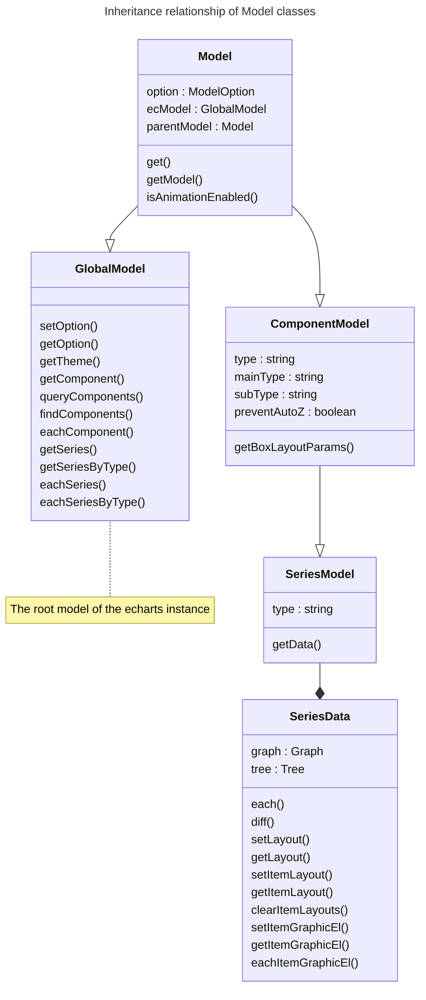

# 数据

本节内容主要是关于 ECharts 数据处理的一些关键点和案例的讲述，通过了解这些内容以更好的完成相关的开发任务。

:::tip

参考 ECharts 官方关于[数据集](https://echarts.apache.org/handbook/zh/concepts/dataset)、[数据转换](https://echarts.apache.org/handbook/zh/concepts/data-transform)、[异步数据的加载与动态更新](https://echarts.apache.org/handbook/zh/how-to/data/dynamic-data)的说明文档。

:::

## 数据层设计

根据 [ECharts 的架构设计](../1-ARCHITECTURE.md#echarts)其遵循经典的 MVC 设计模式，其中数据层（Model）的设计是本节关注的重点。



以上是 ECharts 的 Model 基类关系图，**其中 [GlobalModel](https://github.com/apache/echarts/blob/5.3.3/src/model/Global.ts) 是 ECharts 实例的根 Model 类**，其实现了一系列可以迭代访问组件 Model 和系列 Model 的工具方法。系列 Model 继承自组件 Model，是因为图表也是一种组件，但是一种特殊的组件。

在 ECharts 的设计中，**Model 实例只是用来管理配置项的，数据集则由 [SeriesData](https://github.com/apache/echarts/blob/5.3.3/src/data/SeriesData.ts) 实例进行管理**，可以通过系列 Model 实例的 `getData()` 方法获取其实例。

### 访问组件/系列 Model 实例

所有的组件/系列 Model 实例均可以通过全局 Model 实例访问。

```typescript
// 获取指定类型的首个组件 Model 实例
const componentModel = ecModel.getComponent('tooltip');

// 获取所有的系列 Model 实例
const seriesModels = ecModel.getSeries();

// 获取指定类型的所有系列 Model 实例
const seriesModels = ecModel.getSeriesByType('bar');

// 遍历指定类型的所有系列 Model 实例
ecModel.eachComponent('tooltip', (model: ComponentModel, componentIndex: number) => {
  // TODO
});

// 遍历指定类型的所有系列 Model 实例
ecModel.eachSeriesByType('bar', (series: SeriesModel, rawSeriesIndex: number) => {
  // TODO
});
```

### 访问系列数据集实例

系列数据集实例可通过 Model 实例的 `getData()` 方法获取。

```typescript
const seriesModel = ecModel.getSeriesByType('bar')[0];
const data = seriesModel.getData();
```

#### 遍历数据项

通过以下方式获取数据项信息，以及遍历数据项。

```typescript
// 获取指定索引的数据项信息
const dataItem = data.getRawDataItem(0);
// 获取指定索引的数据项的 Model 实例
const dataItemModel = data.getItemModel(0);

// 遍历数据项
data.each(idx => {
  const dataItem = data.getRawDataItem(idx);

  // TODO
});
```

#### 数据更新

ECharts 允许多次调用 [`setOption`](https://echarts.apache.org/zh/api.html#echartsInstance.setOption) API 来更新渲染效果，所以一般有两种更新视图的方式：

- 全量更新
- 差异更新

对于全量更新来说非常简单，每一次视图层先清除所有旧的视图元素，再使用最新的数据集渲染即可。另外，**差异更新策略一般用来实现新旧数据集的更新过渡动画效果**，数据集实例提供了 `diff()` API 来完成该任务，即对新旧数据集进行差异比对，分别找出新增、更新、移除的数据项，视图层再根据其结果实现相应的入场动画、更新动画、离场动画。

```typescript
const oldData = seriesModel._oldData;
const data = seriesModel.getData();

// 全量更新策略：遍历新的数据集即可
data.each(idx => {
  const dataItem = data.getRawDataItem(idx);

  // TODO
});

// 差异更新策略：进行新旧数据集的差异比对
data.diff(oldData)
  .add(dataIndex => {
    // TODO
  })
  .update((newIndex, oldIndex) => {
    // TODO
  })
  .remove(dataIndex => {
    // TODO
  })
  .execute();
```

:::tip

差异更新策略也可参考 [D3.js 的 `selection.join()` API](https://d3js.org/d3-selection/joining#selection_join)。

:::

:::info

数据处理相关的常用 APIs 可以参考以下文档：

- [Model](../../1-echarts-reference/99-api/Model.md)
- [GlobalModel](../../1-echarts-reference/99-api/GlobalModel.md)
- [ComponentModel](../../1-echarts-reference/99-api/ComponentModel.md)
- [SeriesModel](../../1-echarts-reference/99-api/SeriesModel.md)
- [SeriesData](../../1-echarts-reference/99-api/SeriesData.md)

:::

### 基类

#### `ComponentModel`

> WIP

#### `SeriesModel`

> WIP

:::tip

相关内容可以参考[插件机制中的扩展 APIs](../3-echarts-plugin.md#扩展-apis)。

:::

## 常用数据类型

### 列表（List）

> WIP

### 树（Tree）

> WIP
