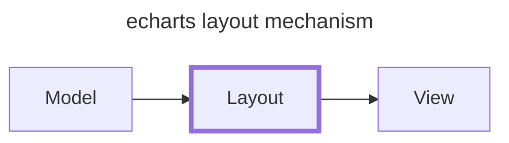

# 布局

本节内容主要是关于 ECharts 布局计算相关的技术简述，并列举一些常用的布局算法和应用案例。

## 布局机制



布局计算是一个相对独立的模块，和其它模块耦合性较低，属于数据处理到视图渲染中间的一个重要环节。

### 布局 APIs

布局计算涉及到存储布局计算的结果信息，以及在视图层获取布局信息并完成图形渲染相关操作。相关 APIs 都是数据集（SeriesData）实例上的：

- 全局布局信息
  - [`setLayout()`](https://github.com/apache/echarts/blob/5.3.3/src/data/SeriesData.ts#L1271)
  - [`getLayout()`](https://github.com/apache/echarts/blob/5.3.3/src/data/SeriesData.ts#L1280)
- 数据项布局信息
  - [`setItemLayout()`](https://github.com/apache/echarts/blob/5.3.3/src/data/SeriesData.ts#L1294)
  - [`getItemLayout()`](https://github.com/apache/echarts/blob/5.3.3/src/data/SeriesData.ts#L1287)

布局信息分为两类：全局的和特定数据项的。

#### 全局布局信息

通常，全局的布局参数是直接设置在系列（series）上的，比如[饼图的 `center` 配置](https://echarts.apache.org/zh/option.html#series-pie.center)，需要将其换算为实际的坐标并存储下来。

示例：

```typescript title="https://github.com/apache/echarts/blob/5.3.3/src/chart/pie/pieLayout.ts#L68"
export function getBasicPieLayout(seriesModel: PieSeriesModel, api: ExtensionAPI):
    Pick<SectorShape, 'cx' | 'cy' | 'r' | 'r0'> {
    const viewRect = getViewRect(seriesModel, api);

    // highlight-next-line
    let center = seriesModel.get('center');
    let radius = seriesModel.get('radius');

    if (!zrUtil.isArray(radius)) {
        radius = [0, radius];
    }
    if (!zrUtil.isArray(center)) {
        center = [center, center];
    }
    const width = parsePercent(viewRect.width, api.getWidth());
    const height = parsePercent(viewRect.height, api.getHeight());
    const size = Math.min(width, height);
    const cx = parsePercent(center[0], width) + viewRect.x;
    const cy = parsePercent(center[1], height) + viewRect.y;
    const r0 = parsePercent(radius[0], size / 2);
    const r = parsePercent(radius[1], size / 2);
    return {
        cx,
        cy,
        r0,
        r
    };
}

export default function pieLayout(
    seriesType: 'pie',
    ecModel: GlobalModel,
    api: ExtensionAPI
) {
    ecModel.eachSeriesByType(seriesType, function (seriesModel: PieSeriesModel) {
        const data = seriesModel.getData();
        const valueDim = data.mapDimension('value');
        const viewRect = getViewRect(seriesModel, api);

        const { cx, cy, r, r0 } = getBasicPieLayout(seriesModel, api);

        // ...

        // highlight-next-line
        data.setLayout({ viewRect, r });

        // ...
    });
}
```

#### 数据项布局信息

另一方面，重点在于数据项的布局信息，一般一个数据项对应一个图形，图形的位置信息表达了数据的分布和趋势等重要信息。

结合全局的布局信息和一些特定的布局算法来完成对数据项的布局计算，以饼图为例：

```typescript title="https://github.com/apache/echarts/blob/5.3.3/src/chart/pie/pieLayout.ts#L68"
export default function pieLayout(
    seriesType: 'pie',
    ecModel: GlobalModel,
    api: ExtensionAPI
) {
    ecModel.eachSeriesByType(seriesType, function (seriesModel: PieSeriesModel) {
        const data = seriesModel.getData();

        // ...

        data.each(valueDim, function (value: number, idx: number) {
            let angle;

            // ...

            const endAngle = currentAngle + dir * angle;
            // highlight-start
            data.setItemLayout(idx, {
                angle: angle,
                startAngle: currentAngle,
                endAngle: endAngle,
                clockwise: clockwise,
                cx: cx,
                cy: cy,
                r0: r0,
                r: roseType
                    ? linearMap(value, extent, [r0, r])
                    : r
            });
            // highlight-end

            currentAngle = endAngle;
        });

        // ...
    });
}
```

以上就是以饼图为例解释了两类布局计算的过程，相对来说比较简单。

:::tip

数据集实例相关操作可以参考[访问系列数据集实例](./0-data.md#访问系列数据集实例)。

:::

### 注册布局算法

布局算法的函数并不直接由数据层（Model）或者视图层（View）调用，而是由 ECharts 的核心流程进行调度，需要事先使用 `registerLayout()` API 进行注册，以饼图为例：

```typescript title="https://github.com/apache/echarts/blob/5.3.3/src/chart/pie/install.ts#L36"
export default function pieLayout(
    seriesType: 'pie',
    ecModel: GlobalModel,
    api: ExtensionAPI
) {
    ecModel.eachSeriesByType(seriesType, function (seriesModel: PieSeriesModel) {
        // TODO
    });
}

export function install(registers: EChartsExtensionInstallRegisters) {
    registers.registerChartView(PieView);
    registers.registerSeriesModel(PieSeriesModel);

    createLegacyDataSelectAction('pie', registers.registerAction);

    // highlight-next-line
    registers.registerLayout(curry(pieLayout, 'pie'));
    registers.registerProcessor(dataFilter('pie'));
    registers.registerProcessor(negativeDataFilter('pie'));
}
```

需要注意的是，**这里的 `seriesType` 需要直接指定为 `'pie'`，否则将无法成功完成饼图的布局计算**。

:::tip

相关内容可以参考[插件机制中的扩展 APIs](../4-echarts-plugin.md#扩展-apis)。

:::

## 常用布局算法

### 笛卡尔坐标系

> WIP

### 树（Tree）

> WIP

### 力导向布局

> WIP
