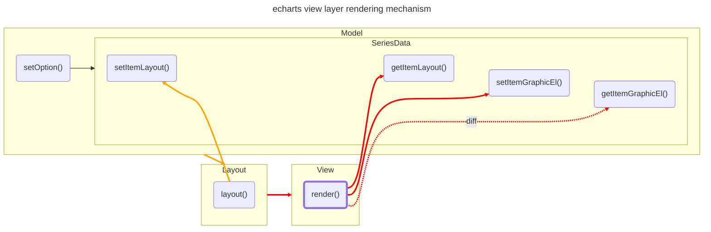

# 渲染

本节内容主要是关于 ECharts 视图层渲染相关的技术讲述，并给出一些常见场景的解决方案案例。

:::tip

参考 ECharts 官方关于[样式](https://echarts.apache.org/handbook/zh/concepts/style)、[视觉映射](https://echarts.apache.org/handbook/zh/concepts/visual-map)的说明文档。

:::

:::note

ECharts 底层依赖的绘图引擎是 [ZRender](https://ecomfe.github.io/zrender-doc/public/)，所以要熟悉其 APIs。

:::

## 视图层渲染机制



以上的程序执行流程图描述了**从配置以及数据（Model & Data）到布局计算（Layout），再到视图渲染（View）**的整体流程，本节需要重点关注的是**视图层的渲染逻辑**。

:::tip

视图层的渲染方法（`render()`）依赖于数据集实例（SeriesData）的大量 APIs，相关内容可以参考[数据处理](./0-data.md)。

:::

### 渲染逻辑的实现

根据数据驱动视图的思想，视图层的渲染逻辑相对简单，**主要目的是根据数据集以及前置环节计算好的布局信息完成图形元素的绘制和更新**。所以，这里将这个过程细分为多个阶段：

1. 获取数据集
2. 获取布局信息
3. 绘制图形
4. 更新图形

而以上流程实际上是基类 `ChartView` 或 `ComponentView` 的 `render()` 方法的具体实现思路。

#### 获取数据集

首先，需要获取到用来绘图的数据集实例，直接可以在 Model 示例上获取：

```typescript title="https://github.com/apache/echarts/blob/5.3.3/src/view/Chart.ts#L151"
class ChartView {
  render(seriesModel) {
    // highlight-next-line
    const data = seriesModel.getData();
  }
}
```

:::tip

更多数据集相关的操作，可以参考数据处理一节中有关[访问系列数据集实例](./0-data.md#访问系列数据集实例)的内容。

:::

#### 获取布局信息

第二步，我们需要遍及数据集并获取布局信息：

```typescript title="https://github.com/apache/echarts/blob/5.3.3/src/view/Chart.ts#L151"
class ChartView {
  render(seriesModel) {
    const data = seriesModel.getData();
    // 全局的布局信息
    // highlight-next-line
    const globalLayoutVal = data.getLayout(key);

    data.each(idx => {
      // 特定数据项的布局信息
      // highlight-next-line
      const itemLayout = data.getItemLayout(idx);
    });
  }
}
```

:::tip

布局信息相关的操作可以参考[布局 APIs](./1-layout.md#布局-apis)。

:::

#### 绘制图形

接下来，根据布局信息来初始化图形元素，完成图形绘制：

```typescript title="https://github.com/apache/echarts/blob/5.3.3/src/view/Chart.ts#L151"
class ChartView {
  render(seriesModel) {
    // highlight-next-line
    const group = this.group;
    const data = seriesModel.getData();
    const globalLayoutVal = data.getLayout(key);

    data.each(idx => {
      // 特定数据项的图形样式配置
      // highlight-next-line
      const itemModel = data.getItemModel(idx);
      const itemLayout = data.getItemLayout(idx);

      // 实例化图形元素
      // highlight-next-line
      const el = new Rect();

      // TODO

      // 添加图形元素实例到画布
      // highlight-next-line
      group.add(el);

      // 保存图形元素实例的引用
      // highlight-next-line
      data.setItemGraphicEl(idx, el);
    });
  }
}
```

:::tip

**基本图形元素**由 ZRender 提供支持，可参考[官方文档](https://ecomfe.github.io/zrender-doc/public/api.html#zrenderdisplayable)。

:::

#### 更新图形

ECharts 支持多次调用 [`setOption()`](https://echarts.apache.org/zh/api.html#echartsInstance.setOption) API 来更新图表内容，所以还需要在视图层支持图形更新的逻辑。有两种更新策略：

- 全量更新
- 差异更新

```typescript title="https://github.com/apache/echarts/blob/5.3.3/src/view/Chart.ts#L151"
class ChartView {
  render(seriesModel) {
    const group = this.group;
    const data = seriesModel.getData();
    const globalLayoutVal = data.getLayout(key);

    // highlight-start
    // --- 全量更新
    // 1. 移除所有旧的图形元素
    group.removeAll();

    // 2. 添加新的图形元素
    data.each(idx => {
      const itemModel = data.getItemModel(idx);
      const itemLayout = data.getItemLayout(idx);
      const el = new Rect();

      // TODO

      group.add(el);
      data.setItemGraphicEl(idx, el);
    });
    // highlight-end

    // highlight-start
    // --- 差异更新
    // 1. 获取旧的数据集实例
    const oldData = this._oldData;

    // 2. 新旧数据集示例差异比对
    data.diff(oldData)
      .add(dataIndex => {
        const itemModel = data.getItemModel(idx);
        const itemLayout = data.getItemLayout(dataIndex);
        const el = new Rect();

        // TODO

        group.add(el);
        data.setItemGraphicEl(dataIndex, el);
      })
      .update((newIndex, oldIndex) => {
        const itemModel = data.getItemModel(newIndex);
        const itemLayout = data.getItemLayout(newIndex);
        const el = oldData.getItemGraphicEl(oldIndex);

        // TODO

        data.setItemGraphicEl(dataIndex, el);
      })
      .remove(dataIndex => {
        const el = oldData.getItemGraphicEl(dataIndex);

        // TODO

        group.remove(el);
      })
      .execute();

    // 3. 保存数据集实例以便下一次进行差异更新
    this._oldData = data;
    // highlight-end
  }
}
```

一般来说，以上两种更新策略选择其一即可，差异更新策略更多是为了保持交互状态不丢失或者实现更新的过渡动画效果。

:::tip

相关内容可以参考：

- [数据更新](./0-data.md#数据更新)
- [动画辅助函数](./3-animation.md#动画辅助函数)

:::

### 基类

#### `ComponentView`

> WIP

#### `ChartView`

> WIP

:::tip

相关内容可以参考[插件机制中的扩展 APIs](../4-echarts-plugin.md#扩展-apis)。

:::

## 常见场景

以下是一些在视图层开发中常见的需求场景及其解决方案。

### 坐标转换

在绘图领域，为了方便对基本图形的管理，一般会有**组**的概念，在 ZRender 中对应的就是 [`Group` 元素](https://ecomfe.github.io/zrender-doc/public/api.html#zrendergroup)。有了组之后，就会出现元素层层嵌套，形成树形结构，为了布局计算的方便，此时就引入了**全局坐标系（global coordinate system）**和**本地坐标系（local coordinate system）**的概念。通常，我们需要对这两者的坐标进行相互转换，可利用以下 APIs：

- [`transformCoordToGlobal()`](https://ecomfe.github.io/zrender-doc/public/api.html#zrendertransformabletransformcoordtoglobalx-y)
- [`transformCoordToLocal()`](https://ecomfe.github.io/zrender-doc/public/api.html#zrendertransformabletransformcoordtolocalx-y)

示例：

```typescript
// 本地坐标 -> 全局坐标
const globalCoords = el.transformCoordToGlobal(0, 0);

// 全局坐标 -> 本地坐标
const localCoords = el.transformCoordToLocal(100, 100);
```

一般来说，我们用的最多的就是本地坐标转换为全局坐标，可以实现将一个 DOM 叠加层的位置坐标和画布中的某个元素的坐标进行同步。

:::tip

##### 如何理解全局坐标系和本地坐标系？

可以类比 CSS 中的[固定定位（`fixed`）和相对定位（`relative`）](https://developer.mozilla.org/en-US/docs/Web/CSS/position)，固定定位就相当于**在全局坐标系中定位，基准原点总是屏幕（画布）的左上角**，而相对定位则相当于**在本地坐标系中定位，基准原点总是父级元素的左上角坐标**。

:::

### 最小外接矩形

元素或者元素集合的[最小外接矩形（BBox）](https://en.wikipedia.org/wiki/Minimum_bounding_rectangle)通常用来实现图形重叠检测等场景的需求，ZRender 提供以下 APIs 来获取：

- [`getBoundingRect()`](https://ecomfe.github.io/zrender-doc/public/api.html#zrendergroupgetboundingrectincludechildren)

示例：

```typescript
const bBox = el.getBoundingRect();
```

另外，如果**画布支持缩放、平移等交互，此时为了获取到视觉上等效的最小外接矩形**，还需要应用一下元素本身的几何变换：

```typescript
// 注意要克隆一下原来的实例，不要对其直接应用变换
const bBoxTmp = bBox.clone();
bBoxTmp.applyTransform(el.transform);
```

:::tip

关于最小外接矩形可以参考 [DOM API](https://developer.mozilla.org/en-US/docs/Web/API/Element/getBoundingClientRect)。

:::
