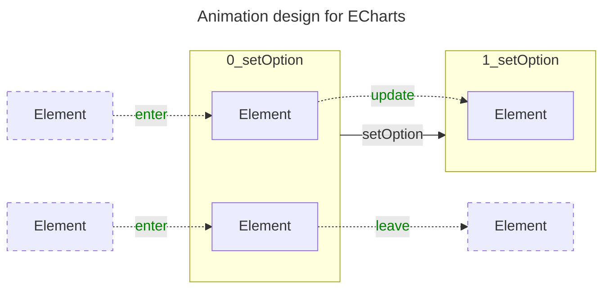

# 动画

本节内容主要是针对动画开发任务，从 ECharts 动画机制设计到动画 APIs，以及通用的辅助函数等方面进行探讨，以帮助我们更高效的完成动画开发。

:::tip

参考 ECharts 官方关于[数据过渡动画](https://echarts.apache.org/handbook/zh/how-to/animation/transition/)的说明文档。

:::

## 动画机制设计



通过[官方说明文档](https://echarts.apache.org/handbook/zh/how-to/animation/transition)和一些[配置项文档](https://echarts.apache.org/zh/option.html#animation)，我们可以了解到 **ECharts 将数据变化引起的视图更新动画整体设计为入场动画、更新动画、离场动画（enter、update、leave）**，与 [D3.js 的设计](https://d3js.org/d3-selection/joining#selection_join)相似。

### 动画 APIs

在视图层，我们可以直接调用 ZRender 元素的动画 APIs 来开发动画效果。

- [`animate()`](https://github.com/ecomfe/zrender/blob/5.3.2/src/Element.ts#L1462)
- [`animateTo()`](https://github.com/ecomfe/zrender/blob/5.3.2/src/Element.ts#L1560)
- [`animateFrom()`](https://github.com/ecomfe/zrender/blob/5.3.2/src/Element.ts#L1570)

其中，`animate()` API 是为元素设置动画，但不立即开始执行动画；而 `animateTo()` 和 `animateFrom()` 则是直接对元素立即执行动画。

示例：

```typescript
// 设置动画
const animator = el.animate('style', false)
  .when(1000, {x: 10} )
  .done(function(){});

// 稍后启动动画
animator.start();
```

也可以立即执行动画：

```typescript
// 立即执行动画
el.animateTo({
  shape: {
    width: 500
  },
  style: {
    fill: 'red'
  }
  position: [10, 10]
}, {
  duration: 100,
  delay: 100,
  easing: 'cubicOut',
  done: () => {}
});
```

虽然我们通过 APIs 直接操作元素的动画更灵活，但在真实的业务场景中，涉及多周期渲染时，我们在新的一周期渲染过程中要处理很多与上一周期相关的动画逻辑才能保证不出问题，例如停止上一周期的动画。所以，更推荐使用后续提到的动画辅助函数来处理大部分动画逻辑。

#### 自定义动画插值

以上我们利用的都是 ZRender 内部实现的动画插值逻辑，已经能满足大部分需求场景了，如果遇到需要实现自定义插值的场景，ZRender 也有相应的 API 提供支持。

```typescript
// highlight-next-line
el.attr({ __tempT: 0 });

// 先设置动画
const animator = el.animate('', false)
  // highlight-start
  .when(1000, { __tempT: 1 })
  .during((percent) => {
    const value = customInterpolator(percent);

    // TODO update element
  })
  // highlight-end
  .done(function(){
    // highlight-next-line
    delete el.__tempT;
  });

// 稍后启动动画
animator.start();

// 或者直接执行动画
el.animateTo({
  // highlight-next-line
  __tempT: 1
}, {
  duration: 100,
  delay: 100,
  easing: 'cubicOut',
  // highlight-start
  during: (percent) => {
    const value = customInterpolator(percent);

    // TODO update element
  },
  // highlight-end
  done: () => {
    // highlight-next-line
    delete el.__tempT;
  }
});
```

这里，自定义动画插值依赖的 API 为 `during` 回调，**不过需要注意的是，为了能让动画成功执行，我们需要给元素一个临时属性（例如以上的 `__tempT`）来启动动画，否则空属性无法执行元素的动画**，那么 `during` 回调也就不会被调用。

在 ECharts 的官方配置项文档中我们也可以找到[相应的配置项](https://echarts.apache.org/zh/option.html#series-custom.renderItem.return_path.during)说明。

:::note

以上所述为两类动画：

- 关键帧动画
- 帧动画

关键帧动画只需要我们给出起始态和终止态，框架内部会完成插值计算，相对来说简单一些，ECharts 的官方配置项文档中也有[提及](https://echarts.apache.org/zh/option.html#series-custom.renderItem.return_path.keyframeAnimation)；另外在一些高度定制化的需求场景中，我们可能需要更灵活的控制动画每一帧的状态，即实现自定义插值逻辑，这就是帧动画。

:::

:::tip

可以参考 ZRender 官方 APIs 文档中的[动画相关内容](https://ecomfe.github.io/zrender-doc/public/api.html#zrenderanimatable)，**但需要注意由于更新不及时，文档中的大多数信息是基于 ZRender v4 版本的**。

:::

:::info

动画相关的 APIs 也可以参考以下文档：

- [Element](../../2-zrender-reference/99-api/Element.md#动画)
- [Animator](../../2-zrender-reference/99-api/Animator.md)

:::

### 动画辅助函数

实际上，ECharts 组件库内部为了方便以统一的方式处理元素的过渡动画，封装了[单独的模块](https://github.com/apache/echarts/blob/5.3.3/src/animation/basicTrasition.ts)来解决这个问题，在开发插件过程中可以直接使用。

- [`initProps()`](https://github.com/apache/echarts/blob/5.3.3/src/animation/basicTrasition.ts#L241)：入场动画
- [`updateProps()`](https://github.com/apache/echarts/blob/5.3.3/src/animation/basicTrasition.ts#L219)：更新动画
- [`removeElement()`](https://github.com/apache/echarts/blob/5.3.3/src/animation/basicTrasition.ts#L272)：离场动画
- [`removeElementWithFadeOut()`](https://github.com/apache/echarts/blob/5.3.3/src/animation/basicTrasition.ts#L303)：淡出动画（移除元素）

示例：

```typescript
data.diff(oldData)
  .add(dataIndex => {
    const itemModel = data.getItemModel(dataIndex);
    const el = new graphic.Rect();

    // highlight-next-line
    initProps(el, itemModel.itemStyle, seriesModel, dataIndex);
    data.setItemGraphicEl(dataIndex, el);
  })
  .update((newIndex, oldIndex) => {
    const itemModel = data.getItemModel(newIndex);
    const el = oldData.getItemGraphicEl(oldIndex);

    // highlight-next-line
    updateProps(el, itemModel.itemStyle, seriesModel, newIndex);
    data.setItemGraphicEl(newIndex, el);
  })
  .remove(dataIndex => {
    const el = oldData.getItemGraphicEl(dataIndex);

    // highlight-next-line
    removeElementWithFadeOut(el, seriesModel, dataIndex);
  })
  .execute();
```

需要注意的是，`removeElement()` 和 `removeElementWithFadeOut()` 之间有一个关键的差异，前者只负责执行动画，而不移除元素，所以需要在动画完成回调中手动移除元素。

```typescript
removeElement(el, props, seriesModel, {
  cb: () => {
    el.parent && el.parent.remove(el);
  }
});
```

### 交互状态动画

前面我们探讨的都是数据变化引起的视图更新动画，其实 ECharts 还有一类动画，即**由交互状态发生变化引起的视图更新动画**。

举一个简单的例子来理解交互状态动画：

```css
button {
  background-color: #fff;
  // highlight-next-line
  transition: all .4s linear;
}

button:hover {
  background-color: #000;
}
```

上述的代码片段展示了一个 `<button>` 标签的样式定义，其中包含了基础样式，以及鼠标悬浮（hover）的样式，即鼠标交互的样式。默认情况下，鼠标悬浮在按钮上时，背景色将直接更新，不过像上述代码添加了 `transition` 的样式属性后，鼠标交互引起的背景色变化将有一个过渡动画效果。

同样的，ECharts 也有交互状态（样式）的设计，这个在[事件与交互](./4-event.md#交互状态)一节中会进行详细说明，在这里需要了解的是如何添加（开启）元素的交互状态更新动画。

```typescript
const rect = new Rect();

// highlight-start
rect.stateTransition = {
  duration: 400,
  easing: 'ease-in',
  during: (percent) => {}
};
// highlight-end
```

如上所示，ZRender 元素有一个 [`stateTransition`](https://github.com/ecomfe/zrender/blob/5.3.2/src/Element.ts#L421) 属性可用来设置交互状态的过渡动画。

:::info

交互状态动画相关的 APIs 也可以参考以下文档：

- [Element](../../2-zrender-reference/99-api/Element.md#状态)

:::
