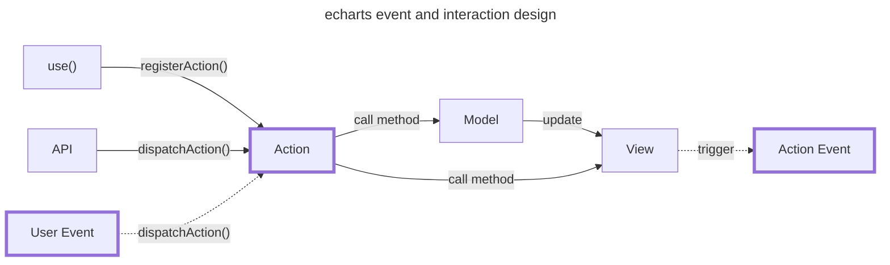

# 事件与交互

本节内容主要是关于 ECharts 事件和交互行为两方面的内容，将其放在一起是因为通常来说交互是由事件触发的，而交互发生的同时也需要暴露一些交互事件。

:::tip

参考 ECharts 官方关于[事件与行为](https://echarts.apache.org/handbook/zh/concepts/event)的说明文档。

:::

## 事件与交互机制设计



上图就是 ECharts 对事件和交互行为的整体设计，**即先利用 `use()` API 注册一个交互行为（Action），某一时刻用户事件（User Event）触发交互行为（Action）逻辑，进而调用数据层（Model）/视图层（View）的方法触发视图更新，最后触发交互事件（Action Event）通知用户当前的交互状态**。这里，我们将事件分为用户事件和交互事件两类。

举例说明，ECharts 的 DataZoom 组件可以响应用户的拖动行为，检测到组件元素的拖动事件（用户事件）时，触发组件注册的用来更新状态的[交互行为（Action）](https://echarts.apache.org/zh/api.html#action.dataZoom)，在完成视图更新后，还会触发相应的[事件](https://echarts.apache.org/zh/api.html#events.datazoom)来通知用户当前状态已发生变化。

### 事件 APIs

事件相关的 APIs 设计遵循经典的事件模型，其具体实现为 [ZRender 的 `Eventful` 类](https://github.com/ecomfe/zrender/blob/5.3.2/src/core/Eventful.ts)，ECharts 类、ZRender 类以及 ZRender 的元素（Element）类均继承自该类，所以 **ECharts 实例、ZRender 实例、ZRender 元素实例**均支持以下事件 APIs：

- [`on()`](https://github.com/ecomfe/zrender/blob/5.3.2/src/core/Eventful.ts#L98)
- [`off()`](https://github.com/ecomfe/zrender/blob/5.3.2/src/core/Eventful.ts#L169)
- [`trigger()`](https://github.com/ecomfe/zrender/blob/5.3.2/src/core/Eventful.ts#L208)

一般来说，**ECharts 实例上的事件是交互事件（Action Event），而 ZRender 实例、ZRender 元素实例上的是用户事件**。

:::tip

相关 APIs 可以参考 [ECharts 官方文档](https://echarts.apache.org/zh/api.html#events)和 [ZRender 官方文档](https://ecomfe.github.io/zrender-doc/public/api.html#oneventname-eventhandler-context)。

:::

### 交互 APIs

交互行为与事件类似，其 APIs 为：

- [`registerAction()`](https://github.com/apache/echarts/blob/5.3.3/src/core/echarts.ts#L2822)
- [`dispatchAction()`](https://github.com/apache/echarts/blob/5.3.3/src/core/echarts.ts#L1338)

这里需要注意的是，根据源码实现来看 **`dispatchAction()` API 的第二个参数的 `silent` 字段可以用来设置是否同时要触发交互事件，默认会触发**。

```typescript title="https://github.com/apache/echarts/blob/5.3.3/src/core/echarts.ts#L1338"
/**
 * @param opt If pass boolean, means opt.silent
 * @param opt.silent Default `false`. Whether trigger events.
 * @param opt.flush Default `undefined`.
 *        true: Flush immediately, and then pixel in canvas can be fetched
 *            immediately. Caution: it might affect performance.
 *        false: Not flush.
 *        undefined: Auto decide whether perform flush.
 */
dispatchAction(
    payload: Payload,
    opt?: boolean | {
        silent?: boolean,
        flush?: boolean | undefined
    }
): void {
    // ...

    const silent = opt.silent;
    doDispatchAction.call(this, payload, silent);

    // ...
}

doDispatchAction = function (this: ECharts, payload: Payload, silent: boolean): void {
    // ...
    if (!silent) {
        const messageCenter = this._messageCenter;
        // highlight-next-line
        messageCenter.trigger(eventObj.type, eventObj);
        // Extra triggered 'selectchanged' event
        if (isSelectChange) {
            const newObj: SelectChangedPayload = {
                type: 'selectchanged',
                escapeConnect: escapeConnect,
                selected: getAllSelectedIndices(ecModel),
                isFromClick: payload.isFromClick || false,
                fromAction: payload.type as 'select' | 'unselect' | 'toggleSelected',
                fromActionPayload: payload
            };
            // highlight-next-line
            messageCenter.trigger(newObj.type, newObj);
        }
    }
}
```

另外，还需要注意，`registerAction()` API 有两个参数值得关注，其中一个是 **`event` 字段，用来指定触发交互事件的类型，如果不指定则取 Action 的 `type` 字段**：

```typescript title=""
doDispatchAction = function (this: ECharts, payload: Payload, silent: boolean): void {
    // ...
    // highlight-next-line
    eventObj.type = actionInfo.event || eventObj.type;

    // ...
}
```

另一个则是 **`update` 字段，用来指定是否要触发整体的更新流程和要调用的更新方法**：

```typescript title="https://github.com/apache/echarts/blob/5.3.3/src/core/echarts.ts#L1935"
doDispatchAction = function (this: ECharts, payload: Payload, silent: boolean): void {
    // ...
    // highlight-next-line
    const cptTypeTmp = (actionInfo.update || 'update').split(':');
    const updateMethod = cptTypeTmp.pop();

    // ...
    if (updateMethod !== 'none' && !isHighDown && !isSelectChange && !cptType) {
        try {
            // Still dirty
            if (this[PENDING_UPDATE]) {
                prepare(this);
                // highlight-next-line
                updateMethods.update.call(this, payload);
                this[PENDING_UPDATE] = null;
            }
            else {
                // highlight-next-line
                updateMethods[updateMethod as keyof typeof updateMethods].call(this, payload);
            }
        }
        catch (e) {
            this[IN_MAIN_PROCESS_KEY] = false;
            throw e;
        }
    }

    // ...
}
```

这里给出一个 AxisPointer 组件的案例：

```typescript title="https://github.com/apache/echarts/blob/5.3.3/src/component/axisPointer/install.ts#L64"
export function install(registers: EChartsExtensionInstallRegisters) {
    // ...

    // Broadcast to all views.
    registers.registerAction({
        type: 'updateAxisPointer',
        // highlight-next-line
        event: 'updateAxisPointer',
        // highlight-next-line
        update: ':updateAxisPointer'
    }, axisTrigger);
}
```

:::tip

相关 APIs 可以参考 [ECharts 官方文档](https://echarts.apache.org/zh/api.html#echartsInstance.dispatchAction)。

:::

### 事件与交互的实现

下面以 [DataZoom(`type: 'slider'`) 组件](https://echarts.apache.org/zh/option.html#dataZoom-slider)的实现为案例进行简单的介绍。

先使用 `registerAction()` API 注册交互行为，其实现逻辑中调用了数据层（Model）实例的方法：

```typescript title="https://github.com/apache/echarts/blob/5.3.3/src/component/dataZoom/dataZoomAction.ts#L26"
export default function installDataZoomAction(registers: EChartsExtensionInstallRegisters) {
    // highlight-start
    registers.registerAction('dataZoom', function (payload, ecModel: GlobalModel) {

        const effectedModels = findEffectedDataZooms(ecModel, payload);

        each(effectedModels, function (dataZoomModel) {
            dataZoomModel.setRawRange({
                start: payload.start,
                end: payload.end,
                startValue: payload.startValue,
                endValue: payload.endValue
            });
        });

    });
    // highlight-end
}
```

在视图层（View）通过 `on()` API 监听元素的用户交互事件，然后使用 `dispatchAction()` API 触发交互行为：

```typescript title="https://github.com/apache/echarts/blob/5.3.3/src/component/dataZoom/SliderZoomView.ts#L85"
class SliderZoomView {
    private _renderHandle() {
        // ...

        actualMoveZone.attr({
            draggable: true,
            cursor: getCursor(this._orient),
            drift: bind(this._onDragMove, this, 'all'),
            ondragstart: bind(this._showDataInfo, this, true),
            // highlight-next-line
            ondragend: bind(this._onDragEnd, this),
            onmouseover: bind(this._showDataInfo, this, true),
            onmouseout: bind(this._showDataInfo, this, false)
        });
    }

    private _onDragEnd() {
        this._dragging = false;
        this._showDataInfo(false);

        // While in realtime mode and stream mode, dispatch action when
        // drag end will cause the whole view rerender, which is unnecessary.
        const realtime = this.dataZoomModel.get('realtime');
        // highlight-next-line
        !realtime && this._dispatchZoomAction(false);
    }

    _dispatchZoomAction(realtime: boolean) {
        const range = this._range;

        // highlight-start
        this.api.dispatchAction({
            type: 'dataZoom',
            from: this.uid,
            dataZoomId: this.dataZoomModel.id,
            animation: realtime ? REALTIME_ANIMATION_CONFIG : null,
            start: range[0],
            end: range[1]
        });
        // highlight-end
    }
}
```

### 交互状态

前面所述内容关注的都是整体交互流程，针对 ZRender 元素如何响应交互行为，ECharts 设计了元素的**状态（state）**这一概念。以常规的 CSS 来举例说明：

```css
a {}
a:visited {}
a:hover {}
a:active {}
```

以上就是经典的 `<a>` 标签的 4 种状态样式，ECharts 设计的元素状态也是类似的。

```typescript title="https://github.com/apache/echarts/blob/5.3.3/src/util/states.ts#L86"
export const SPECIAL_STATES = ['emphasis', 'blur', 'select'] as const;
export const DISPLAY_STATES = ['normal', 'emphasis', 'blur', 'select'] as const;
```

以上是 ECharts 定义的全局统一的状态分类，在[官方配置项文档](https://echarts.apache.org/zh/option.html#series-line.emphasis)中也随处可见。而针对这些状态的处理也是在全局实现的，而不是由各个组件自己实现：

```typescript title="https://github.com/apache/echarts/blob/5.3.3/src/core/echarts.ts#L2032"
bindMouseEvent = function (zr: zrender.ZRenderType, ecIns: ECharts): void {
    zr.on('mouseover', function (e) {
        const el = e.target;
        const dispatcher = findEventDispatcher(el, isHighDownDispatcher);
        if (dispatcher) {
            // highlight-next-line
            handleGlobalMouseOverForHighDown(dispatcher, e, ecIns._api);
            markStatusToUpdate(ecIns);
        }
    }).on('mouseout', function (e) {
        const el = e.target;
        const dispatcher = findEventDispatcher(el, isHighDownDispatcher);
        if (dispatcher) {
            // highlight-next-line
            handleGlobalMouseOutForHighDown(dispatcher, e, ecIns._api);
            markStatusToUpdate(ecIns);
        }
    });
};
```

#### 状态 APIs

以上是对 ECharts 如何统一定义和处理元素状态的机制的简述，具体到某个 ZRender 元素实例上时，有相应的 APIs 来处理状态变化：

- 状态定义
  - [`states`](https://github.com/ecomfe/zrender/blob/5.3.2/src/Element.ts#L416)
  - [`stateProxy()`](https://github.com/ecomfe/zrender/blob/5.3.2/src/Element.ts#L429)
- 状态切换
  - [`useState()`](https://github.com/ecomfe/zrender/blob/5.3.2/src/Element.ts#L837)
- 状态过渡动画
  - [`stateTransition`](https://github.com/ecomfe/zrender/blob/5.3.2/src/Element.ts#L421)

示例：

```typescript
// * 为元素实例添加一个鼠标的 hover 效果
// 为元素注册一个 hover 状态对象
// highlight-start
el.states.hover = {
  style: {
    fill: 'red',
  },
};
// highlight-end

// 设置元素的状态转换动画
// highlight-start
el.stateTransition = {
  duration: 400,
  done: () => {
    console.log('switch state done!');
  },
};
// highlight-end

// 添加鼠标事件
el.onmouseover = function () {
  // highlight-next-line
  el.useState('hover', true);
};
el.onmouseover = function () {
  // highlight-next-line
  el.removeState('hover');
};
```

:::tip

状态过渡动画可以查看动画一节关于[交互状态动画](./3-animation.md#交互状态动画)的说明。

:::

:::info

相关 APIs 可以参考 [Element](../../zrender-reference/api/Element.md#状态)。

:::
