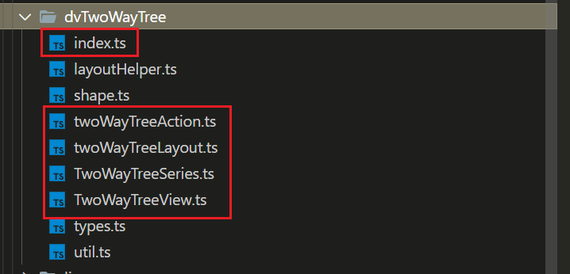

# 图表插件

> WIP

本节内容主要是关于如何开发**图表插件，即为 ECharts 新增一种类型图表的实现**。

:::info

了解技术细节，请参考 [ECharts 的插件机制](../4-echarts-plugin.md)。

:::

## 案例

### 双向树图

这里以实现一个新类型（双向树）图表为例，直接给出一个实际的插件开发案例，来加深对 ECharts 扩展机制的了解。

首先，对于新类型（双向树）的图表，Model 和 View 都需要我们自己来实现，其次还需要实现双向树的布局算法。那么，文件结构如下：



其中，`index.ts` 文件即就是我们之前提到的柱状图案例中的 `install.ts` 文件，实现如下：

```typescript
export function install(registers: EChartsExtensionInstallRegisters) {
  installTreeAction(registers);

  registers.registerSeriesModel(TwoWayTreeSeriesModel);
  registers.registerChartView(TwoWayTreeView as unknown as typeof ChartView);
  registers.registerLayout(twoWayTreeLayout);
}
```

双向树图中的实现中主要涉及到 Model、View、Action 和布局算法，这四部分 ECharts 都有相应的扩展 API，我们只需要负责逻辑实现即可。Model 和 View 分别要继承 ECharts 提供的基类 `SeriesModel` 和 `ChartView`，并实现要求必须实现的方法，例如 `ChartView` 中的 `render()` 方法，细节我们可以查看 ECharts 基类源码和现有类型的图表实现源码进行参考。

最重要的一个细节就是 `type` 字段的指定，这是用来关联所有同类型图表实现逻辑的关键。

```typescript
export default class TwoWayTreeSeriesModel extends SeriesModel<TwoWayTreeSeriesOption> {
  static readonly type = 'series.dvTwoWayTree';

  readonly type = TwoWayTreeSeriesModel.type;
}

export default class TwoWayTreeView extends ChartView {
  static readonly type = 'dvTwoWayTree';

  readonly type = TwoWayTreeView.type;
}

export default function twoWayTreeLayout(
  ecModel: GlobalModel,
  api: ExtensionAPI
) {
  ecModel.eachSeriesByType(
    'dvTwoWayTree',
    (seriesModel: TwoWayTreeSeriesModel) => {
      commonLayout(seriesModel, api);
    }
  );
}
```

实际上，扩展一个新类型的图表实现代码层面是有很大的自由度的，只需要遵循以上提到的一些细节性约束即可，剩下的根据具体业务场景编写逻辑实现即可。
